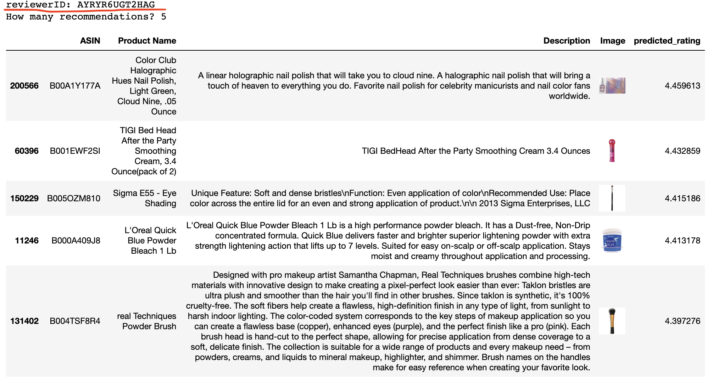
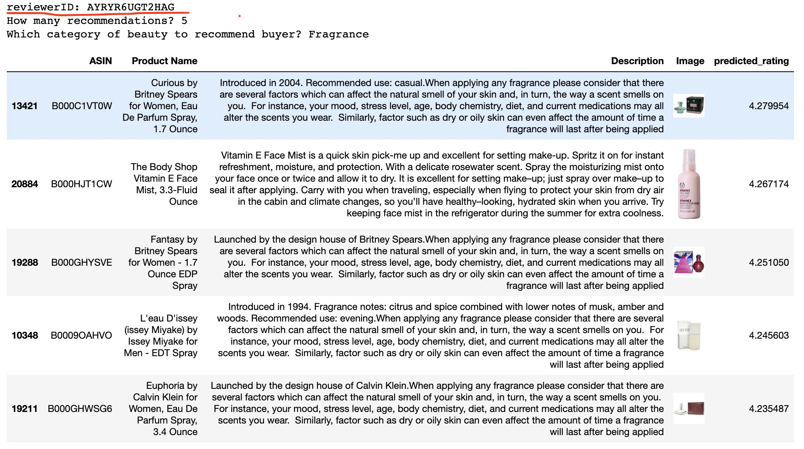

# Recommendation-Systems for Amazon Beauty Products
Authors: Margaret Boland, Jillian Clark, and Alex FitzGerald

## Overview
This project aims to create a recommendation system for the Amazon marketing team to utilize to send targeted recommendation e-mails to users who have purchased and rated products within 30 days. A collaborative approach was taken, meaning recommendations will be made by comparing similar reviewer profiles based on existing ratings. 

## Business Problem

## Data Understanding and Preparation
Data for this project was pulled from a compiled dataset of Amazon Beauty product reviews and meta data in two seperate JSON files. The datasets can be found here (LINK TO SITE). We utlized the smaller dataset known as 5-core which contained data for products and reviewers with at least 5 entries. 

Our review data contained 198,502 reviews from 22,363 reviewers. The reviews spanned across 12,101 unique products. Reviews ranged on a scale of 1-5. A majority of reviews received an overall review of 5, which could be a limitation to our model. 


Here we see a distribution of the number of reviews each product has received. A majority of our ratings received under 10 ratings.


Here we see a distribution of the number of reviews each user has completed. We see a majority of our users rated under 10 products.


Our Meta Data contained 259,204 unique products. We looked further into the Beauty subcategories to create a recommendation system to return items specifically in that subcategory. We found that the six subcategories related to Beauty are: Skin Care', 'Tools & Accessories', 'Makeup', 'Hair Care', 'Bath & Body', and 'Fragrance'.

Our data did not require much cleaning. We selected the appropriate columns of our model to utilize for surprise, which included 'reviewerID', 'asin', and 'overall'. This data contained our unique reviewer ID, unique product ID, and overall rating on a scale of 1-5.

## Methods

We utilized a Normal Predictor model for our initial model, which returned an RMSE of 1.5. We iterated through the following model algorithms to assess which models to further explore: SVD(), SVDpp(), SlopeOne(), NMF(), NormalPredictor(), KNNBaseline(), KNNBasic(), KNNWithMeans(), KNNWithZScore(), BaselineOnly(), and CoClustering(). Our results were based on cross validation and returning the RMSE for each model, along with the fit time and test time. The top 3 models according to Test RMSE were SVDpp, SVD, and Baseline Only. Based on these results, we chose those 3 models to explore further.

We ran multiple grid searchs to test hyperparameters for SVDpp and SVD. Our best model based on RMSE was an SVD model with the following paramenters specified: (n_factors=2, n_epochs=20, biased=True).


## Final Collaborative Filtering Models

Our final model allows us to input the unique reviewerID and number of recommendations we would like the model to return. The model then returns the requested number of items, including the ASIN, Product Name, Description, Image, and predicted_rating. Recommended products are ordered from the highest predicted_rating to the lowest.



Our additional final model allows us to input the unique reviewerID, the number of recommendations we would like the model to return, and the category of product we would like our recommended products to be. The model then returns the requested number of items, including the ASIN, Product Name, Description, and Image. This will be especially helpful when trying to promote certain items at certain times of year, like Fragrances around Valentine's Day or Skin Care products in the winter time. 



## Conclusion

## Next Steps

## Repository Structure
```
├── data
│   ├── meta_Beauty.json.gz
│   ├── reviews_Beauty_5.json.gz
├── images
│   ├── recommended_fragrance_products.png
│   ├── recommended_products.png
│   ├── reviews_distribution.png
│   ├── reviews_per_product.png
│   ├── reviews_per_user.png
├── working_notebooks
│   ├── review_data
│   ├── meta_data
├── .gitignore
├── LICENSE.md
├── README.md
├── notebook.pdf
├── presentation.pdf
└── student.ipynb
```
